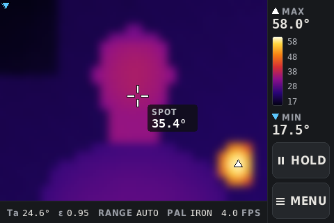
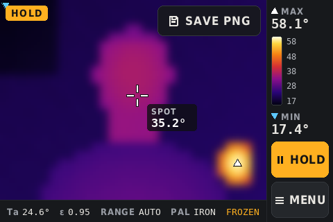
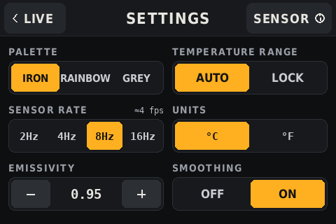
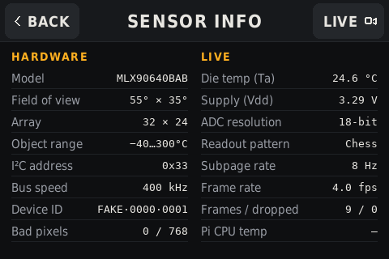

# Thermal camera

A handheld thermal camera for finding draughts and cold spots at home. It uses a Raspberry Pi 2, a
Pimoroni MLX90640 (32×24 pixels) and an Adafruit PiTFT 3.5" resistive touchscreen, powered by a power bank.
It boots straight into the camera: no desktop, no keyboard, no mouse cursor.

| Live | Hold |
|---|---|
|  |  |
| **Settings** | **Sensor info** |
|  |  |

The UI follows the `thermal-cam-ui` design package (SPEC.md plus mockups). For how the software is built,
see **[HOW_IT_WORKS.md](HOW_IT_WORKS.md)**.

---

## 1. Hardware

| Part | Notes |
|---|---|
| Raspberry Pi 2 Model B | 32-bit OS only. No onboard Wi-Fi, so it uses a USB Wi-Fi dongle. |
| Pimoroni MLX90640 breakout | I²C address `0x33`. The standard lens is 55°×35° (`MLX90640BAB`); the wide one is 110°×75° (`MLX90640BAA`). |
| Adafruit PiTFT 3.5" 480×320 resistive HAT | SPI, with an STMPE610 touch controller. Used in landscape. |
| Sensor wiring | 3.3V → pin 1, SDA → pin 3, SCL → pin 5, GND → pin 6 (on the second header of the GPIO multiplexing board) |
| microSD | SanDisk Ultra 32GB, Raspberry Pi OS Lite (32-bit) |

## 2. Install (once)

1. **Flash the card.** Use Raspberry Pi Imager with **Raspberry Pi OS Lite (32-bit)**. Open the settings (⚙) and
   set the hostname (for example `thermalcam`), your user, SSH and the Wi-Fi network for the dongle.
2. **Copy the project over** from your laptop:
   ```sh
   scp -r ~/dev/personal/thermal-camera <user>@thermalcam.local:~/
   ```
3. **Run the setup script** on the Pi, then reboot:
   ```sh
   ssh <user>@thermalcam.local
   cd ~/thermal-camera && ./setup.sh && sudo reboot
   ```
   `setup.sh` does all of this:
   - installs pygame, numpy, evdev, i2c-tools and the DejaVu fonts from apt
   - creates `.venv` containing Blinka and the pinned MLX90640 library
   - installs the PiTFT driver
   - turns on I²C
   - enables `thermalcam.service`, so the camera starts at every boot

   Options, set as environment variables in front of `./setup.sh`:

   | Variable | Default | Use |
   |---|---|---|
   | `PITFT_ROTATION` | `90` | Set `270` if the picture is upside down |
   | `I2C_BAUD` | `400000` | The spec suggests `1000000` for more speed, if the sensor wiring is short and solid |
   | `SKIP_PITFT=1` | – | Skip the display-driver step |

4. **First boot.** The screen shows three crosses. Tap the centre of each one firmly (with a fingernail or
   a stylus). This is the touch calibration, and it's saved. Then the Live view appears.

> **Why not "HDMI mirror" mode?** Adafruit's installer refuses mirror mode on current Pi OS Lite, so
> setup installs only the display driver, and the app draws straight to the screen.
> [HOW_IT_WORKS.md](HOW_IT_WORKS.md#display) has the details.

## 3. Using it

### Live view
- **The image:** the white ▲ marks the hottest point and the cyan ▼ the coldest.
- **Spot meter:** the crosshair with its SPOT reading. **Tap anywhere on the image** to move it to that pixel.
  The position is remembered.
- **Right column:** MAX and MIN temperatures, and the colour scale with 5 ticks.
- **HOLD** freezes the picture. While it's held:
  - a HOLD badge and **SAVE PNG** appear on the image
  - the strip shows **FROZEN**
  - SAVE writes a screenshot and a CSV of the raw temperatures (the button briefly reads SAVED)

  Tap HOLD again to go live.
- **MENU** opens Settings.
- **Bottom strip:** die temperature (Ta), emissivity (ε), range mode, palette and frames per second.

### Settings
Every change applies immediately and survives reboots.

| Setting | Options | What it does |
|---|---|---|
| Palette | Iron / Rainbow / Grey | The colour map |
| Temperature range | Auto / **Lock** | Lock fixes the colour scale at the current min/max. **Use this to compare rooms**: the same colour means the same temperature everywhere. |
| Sensor rate | 2 / 4 / 8 / 16 Hz | The sensor's subpage rate. A full image arrives at half this rate (shown as "≈N fps"). On a Pi 2 the Python driver is the real limit, so expect 1–4 fps. |
| Units | °C / °F | Applies to every temperature on every screen |
| Emissivity | 0.10 – 1.00 (−/+ in steps of 0.01) | 0.95 suits walls, wood, paint, plaster and skin. Shiny metal and glass reflect heat and read wrong whatever you set. |
| Smoothing | Off / On | Blurred, smooth image, or the raw 32×24 blocks |

**SENSOR ⓘ** opens Sensor info.

### Sensor info
Two columns, refreshed about once a second:
- **Hardware:** model, field of view, array size, object range, I²C address, bus speed (read back from the
  system), the sensor's unique ID and the number of bad pixels.
- **Live:** die temperature, supply voltage, ADC resolution and readout pattern (read from the sensor's
  control register every frame), subpage rate, measured frame rate, frames/dropped counters and the Pi's CPU temperature.

Anything that can't be read shows "—".

### Snapshots
Saved to `~/thermalcam/snapshots/`:
- `YYYYMMDD-HHMMSS.png` is the screen exactly as shown.
- `YYYYMMDD-HHMMSS-raw.csv` holds 24 rows × 32 columns of °C to 2 decimals, which you can open in a spreadsheet.

The Pi 2 has no clock battery. Until it has synced the time over Wi-Fi, files are numbered `snap-0001.png` and so on.
To copy them to your laptop: `scp '<user>@thermalcam.local:thermalcam/snapshots/*' .`

### Finding draughts
- **Where to look:** window and door frames, skirting boards, loft hatches, and sockets and light
  switches on outside walls.
- **What to look for:** cold air leaking in shows as streaks or fans of colder colour spreading out from a gap.
- **Comparing rooms:** set **Lock** in a warm room first, then walk around. That keeps the colours comparable.
- **When:** the camera works best on a cold day with the heating on, when the inside–outside difference is large.

### Switching off
The design has no power-off button. You can pull the power bank's cable (the settings file is written in a
way that survives that), but for the SD card's sake it's better to run `ssh <user>@thermalcam.local sudo poweroff`
first when you can.

## 4. Configuration file

`~/.config/thermalcam/config.json` is written by the Settings screen. A few options exist only here:

| Key | Default | Meaning |
|---|---|---|
| `flip_h` / `flip_v` | `true` / `false` | Mirror the image so it matches what you see |
| `sensor_model` | `"MLX90640BAB"` | `"MLX90640BAA"` if you have the 110° wide-angle sensor. It only changes the text on Sensor info. |
| `touch_min_pressure` | `0` | Ignore contacts lighter than this (the STMPE reports pressure from 0 to 255). Try 20–40 if light brushes trigger taps. |
| `i2c_address` | `51` (0x33) | The sensor's I²C address |
| `fonts` | `{}` | Override font files, for example `{"cond_bold": "/path/BarlowCondensed-Bold.ttf"}` |
| `touch_calibration` | set on first boot | Delete the key, or run `main.py --calibrate`, to calibrate again |

After editing the file by hand: `sudo systemctl restart thermalcam`.

## 5. Troubleshooting

```sh
journalctl -u thermalcam -b          # the app's log: which display and touch device it picked, errors
i2cdetect -y 1                        # the sensor should show as 33
cat /sys/class/graphics/fb*/name /sys/class/graphics/fb*/virtual_size   # the PiTFT framebuffer is 480,320
vcgencmd get_throttled                # anything but 0x0 means undervoltage: use a better power bank or cable
```

| Symptom | Fix |
|---|---|
| "SENSOR NOT FOUND — RETRYING" on the image | Check the four sensor wires and run `i2cdetect -y 1`. The app reconnects on its own once the sensor answers. |
| Taps land in the wrong place | `sudo systemctl stop thermalcam && .venv/bin/python main.py --calibrate`, then `sudo systemctl start thermalcam` |
| Picture upside down | `PITFT_ROTATION=270 ./setup.sh`, then reboot |
| Picture mirrored | Set `"flip_h": false` in the config |
| Blank screen, service keeps restarting | Check `journalctl -u thermalcam`. "No 480x320 framebuffer" means the PiTFT driver didn't load; run `./setup.sh` again. |
| Many "dropped" frames on Sensor info | Choose a lower sensor rate, or keep `I2C_BAUD` at 400000 |

## 6. Development on a laptop

```sh
uv venv -p 3.12 .venv && uv pip install pygame numpy pytest   # Homebrew Python 3.14 has no pygame wheel yet
.venv/bin/python main.py --windowed --fake-sensor               # the mockup's scene, animated
.venv/bin/python -m pytest tests/                               # 21 tests: UI, touch, sensor worker, framebuffer
```

In the window, the mouse acts as your finger. Keys: `h` hold, `s` save (while held), `m` settings, `i` sensor info,
`esc` back, `q` quit. The fake sensor uses its own config file only if you pass `--config /tmp/x.json`;
otherwise it shares `~/.config/thermalcam/config.json`.
